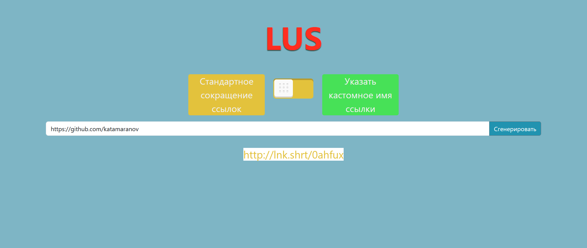

# DEMOPROJECT-Laravel-URL-Shortener
branch:</br>
➖ master</br>
✔️ k3d-cluster</br>
➖ real-sharding



___
## The following instructions are for testing on your local k3d cluster

<i>before you start, make sure that you have enough disk space, and most importantly RAM</i>

### create k3d cluster

```k3d cluster create --api-port 6550 -p "80:80@loadbalancer" --agents 5 --servers 2 --volume "C:\path\to\dir_where_demoproject_located:/home/dev@agent:*"```

you can change the number of servers, it doesn't matter to run the project.

### assigning labels to created nodes

```kubectl label nodes k3d-k3s-default-agent-0 servicetype=main```</br>
```kubectl label nodes k3d-k3s-default-agent-1 servicetype=redirect```</br>
```kubectl label nodes k3d-k3s-default-agent-2 servicetype=fpm```</br>
```kubectl label nodes k3d-k3s-default-agent-3 servicetype=mongodb```</br>
```kubectl label nodes k3d-k3s-default-agent-4 servicetype=fcc```

### images

my images from docker hub are already written in the deployments, but if you want to build the images yourself (and, for example, push them to local docker registry), do not forget to execute hash_installation.bat

### preparing mongodb and php-fpm

<i>after cloning the project, change the branch ```git switch k3d-cluster```</i>

in the <b>manifests/mongodb</b> and <b>manifests/phpfpm</b> folders execute ```kubectl apply -f .``` and then create services for them
```kubectl create service clusterip fpm --tcp=9000:9000``` and
```kubectl create service clusterip mongodb --tcp=27017:27017```

### running deployments

if you renamed the folder with the github project or changed the path of the mount volume when creating the cluster, do not forget to change these paths in the deployment files and in the nginx configmaps.

now you need to get the domain names of mongodb and fpm: ```kubectl get ep```.
Take the mongodb IP address and put it in the next line: X-X-X-X.mongodb.default.svc.cluster.local (instead of X). And the same with fpm, just replace .mongodb with .fpm in the line. In <b>mainPage</b>, <b>redirectPage</b>, and <b>fullChunkChecker</b> folders create .env file and paste it there:
```
DB_CONNECTION=mongodb
DB_HOST=X-X-X-X.mongodb.default.svc.cluster.local
DB_PORT=27017
DB_DATABASE=lus
DB_USERNAME=root
DB_PASSWORD=example
```
next, in the <b>manifests/main</b> and <b>manifests/redirect</b>, open the *-configmap.yaml files and replace the contents of the fastcgi_pass string with X-X-X-X.fpm.default.svc.cluster.local:9000;

and finally in the <b>manifests/main</b>, <b>manifests/redirect</b>, <b>manifests/fcc</b> folders run ```kubectl apply -f .```

create services: ```kubectl create service clusterip nginx --tcp=80:80``` and ```kubectl create service clusterip redirectnginx --tcp=80:80```

### preparation of laravel projects

run ```kubectl get po``` and copy the name of the pod starting with <i>nginx-deployment</i> and then run ```kubectl exec -it copied_name -- sh```

go to <b>/usr/share/nginx/html/mainPage</b> and run the following commands:

1) <i>composer install</i> (if you get error - the process exceeded the timeout of 300 seconds, just re run command or run ```export COMPOSER_PROCESS_TIMEOUT=600```)
2) <i>php artisan key:generate</i>
3) <i>php artisan migrate:fresh --seed</i>

then ```cd ..``` and repeat steps 1-2 for <b>redirectPage</b> folder. Exit the pod, and separately for <i>fcc-deployment</i>, run kubectl exec and in <b>/usr/share/nginx/html/fullChunkChecker</b> repeat steps 1-2

### chunk checker

In the same folder <b>fullChunkChecker</b> run ```php artisan schedule:work```. You can now close the console.

### hosts file 

add ```127.0.0.1 my.shrt.com``` and ```127.0.0.1 lnk.shrt``` to C:\Windows\System32\drivers\etc\hosts file
___

And as usual, after my.shrt.com.com/login you can access my.shrt.com/adminer (email: admin@a.com password: 12345678!)
